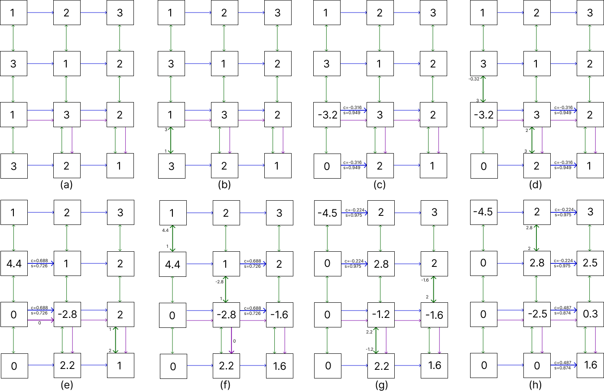

# QR factorization with Givens rotation

Here you can find the implementation for a matrix A in QR in cerebras. This implementation does not compute the Q matrix and also assumes one element per PE.
 
The main idea is exposed in the next image, which describes the flow of the data in a 4x3 matrix with some steps combined to reduce the amount of matrix displayed, where colored arrows represent the communication channels used, if an arrow is thicker than others, it means that the channel is being used, emitting the data labeled near the arrow.
  

3 colors have been used:
 - The green color is for send and receive elements of the A matrix, it works using switches, the bottom row switch between send to north and receive from north, the top row switch between receive from south and send to south, and the middle rows switch between receive from south, send to south, send to north, receive from north. Upon receiving an element from this color, if was received from south, the PE send their own element of A to the south, then, they compute sine and cosine, update their A values and then send the sine and cosine computed to the EAST. If the PE that started this communication was in the penultimate row, it also will send a 0 signal to the east. Finally, if the element that receive data from the south is not a diagonal element, it will send their value (now upfated) of A to the north.
 - The blue color is used to send and receive the sine and cosine for update the values of the row after an element is changed to 0. Upon receiving a value from this color, the PEs set a flag that will avoid the computation of sine and cosine with their north/south neighbor, then if the PE is in the same row that the one that was computed to 0, it will send their own A value to the norht.
 - The purple color is used to send a signal from a PE in the penultimate row to the PE that is one column right in the bottom row. This signal will be send when an element in this row becomes 0 because the rotation. Upon receiveng a element from this color, if the element is in the penultimate row, it will send this to south, on the other hand, if the element is in the bottom row, it will send their own value of A to the north, starting the givens rotations in their column.

