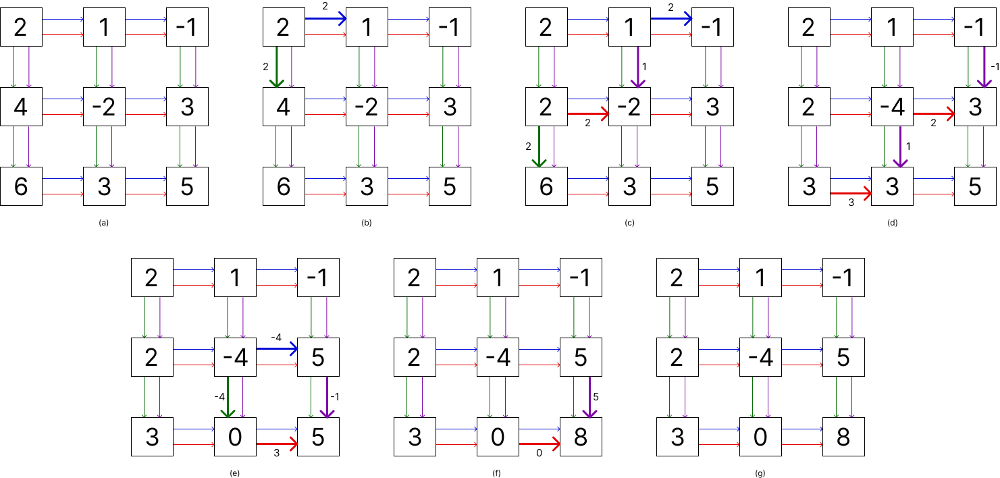

# LU factorization without pivoting

Here you can find the implementation for a matrix A in LU in cerebras. This implementation does not implement pivoting.
 
In this folder you can find two versions, one that works with one element per PE and another that works with many elements per PE. The main idea behind is the same for both although the second version has some changes due to the need to update the submatrix of the PE.
 
The main idea is exposed in the next image, which describes the flow of the data in a 3x3 matrix, where colored arrows represent the communication channels used, if an arrow is thicker than others, it means that the channel is being used, emitting the data labeled near the arrow.
  

4 colors have been used:
 - The blue color is used to emit a signal horizontally, when a PE receive a value from this color, it send his self value down for the elimination step.
 - The purple color is used vertically in the elimination step, when a PE receive a value from this color, it stores it and perform the elimination if able.
 - The green color is for the division step, when a PE receives a value from this color, it divide the value stored in the PE by the value received and then send the result to the right.
 - The red color is used horizontally in the elimination step, when a PE receives a value from this color, it stores it and performs the elimination if able.

A PE is able to perform the elimination step when it has received both values necessary for it, one from the purple color (north) and one from the red color (west). After this, if the PE is in the diagonal and have been performed an amount of elimination steps equal to it column number (starting from 0), it will start a division step, sending self value to the south using the green color and will send a signal (self value in this case) to the east using the blue color.

